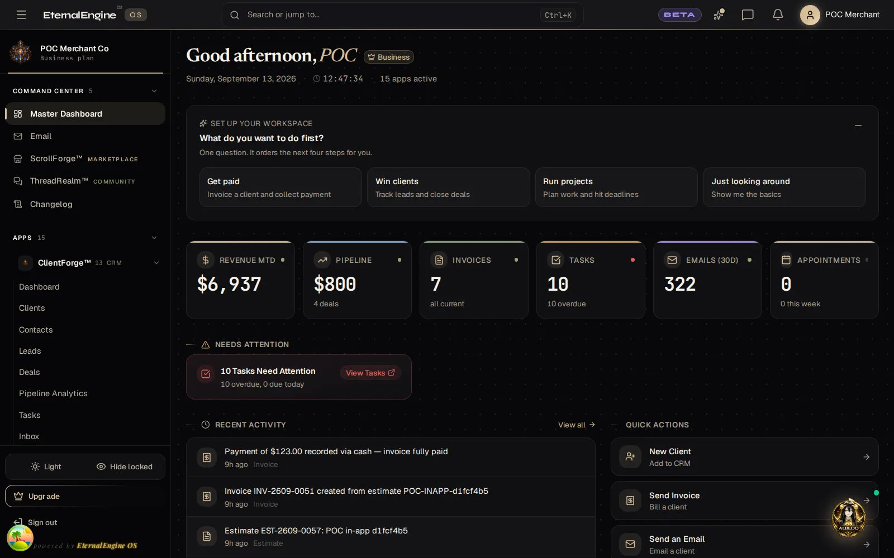
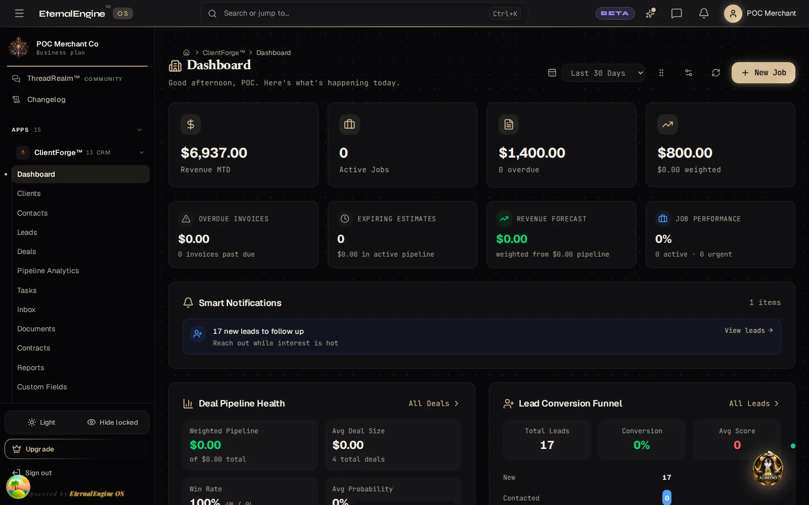
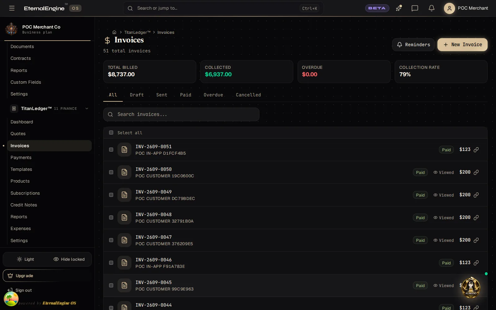
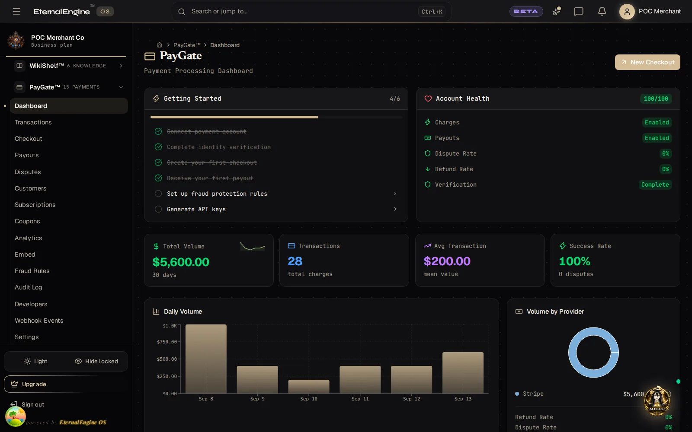

  

<h1 align="center">EternalEngine</h1>

<strong>The operating system for service businesses.</strong>

CRM, quotes, invoicing, payments, scheduling, email, projects and an AI assistant — one login, one bill.

  <a href="https://app.eternalengineos.io/signup?plan=free&interval=annual"><strong>Start free</strong></a> ·
  <a href="https://eternalengineos.io/pricing">Pricing</a> ·
  <a href="https://eternalengineos.io/features">Features</a> ·
  <a href="https://eternalengineos.io/developers">Developers</a> ·
  <a href="https://eternalengineos.io/security">Security</a> ·
  <a href="https://eternalengineos.io/status">Status</a>

  
  
  
  

  

---

EternalEngine replaces the stack a service business assembles from six or seven vendors with
one platform. A plumber, an electrician, a landscaper, a cleaning company or a consultancy
signs in once and gets a CRM, quotes that turn into invoices, card and bank payments, a
booking page, a full email system, projects and crews, documents and signatures, and an AI
assistant that already knows the business. Seventeen applications ship today; add-on apps
join the catalog at no extra charge as they reach launch quality.

| At a glance | |
|---|---|
| Applications | 17 installable, one login, one subscription |
| Price | Free at $0 · Basic $9.95/mo · Team $49 · Pro $99 · Business $199 · Enterprise by contact |
| Payments | Built in, on Stripe, at one all-in rate |
| Reliability | 99.9% uptime target, public [status page](https://eternalengineos.io/status) |
| Developers | Read-only public API and an MCP server for AI agents — [docs](https://eternalengineos.io/developers) |
| Source | The product is proprietary; this organization publishes the documentation, policies and changelog |

## Products

### Sell and get paid

| App | What it does |
|---|---|
| [ClientForge](https://eternalengineos.io/features/clientforge/) | CRM: contacts, accounts, deals and pipelines, with email sequences and custom fields. |
| [BidForge](https://eternalengineos.io/features/bidforge/) | Line-item quotes and takeoffs customers sign digitally, then auto-invoice. |
| [TitanLedger](https://eternalengineos.io/features/titanledger/) | Invoicing, payments and books: the money hub, with aging and multi-currency. |
| [PayGate](https://eternalengineos.io/features/paygate/) | Native checkout, subscriptions and payouts at one all-in rate, no separate processor fee. |

### Schedule and deliver the work

| App | What it does |
|---|---|
| [BookSlot](https://eternalengineos.io/features/bookslot/) | Branded booking pages with Google and Outlook sync and confirmations. |
| [ProjectPath](https://eternalengineos.io/features/projectpath/) | Tasks, milestones, daily logs and time tracking; work that bills itself. |
| [CrewGrid](https://eternalengineos.io/features/crewgrid/) | Work orders, technicians and routing: dispatch the right crew to the job. |
| [StockShelf](https://eternalengineos.io/features/stockshelf/) | Stock levels, purchase and sales orders, and stocktakes. |
| [SignSeal](https://eternalengineos.io/features/signseal/) | Envelopes, signatures and a full signer audit trail. |
| [AssetVault](https://eternalengineos.io/features/assetvault/) | Client deliverables and contracts, versioned and previewable. |

### Communicate

| App | What it does |
|---|---|
| [PostFrame](https://eternalengineos.io/features/postframe/) | Transactional and marketing email with SPF, DKIM, DMARC and tracking; no third-party sender. |
| [NotifyStack](https://eternalengineos.io/features/notifystack/) | Templated transactional notifications at scale. |
| [ThreadRealm](https://eternalengineos.io/features/threadrealm/) | Community boards, threads, polls and direct messages for your customers. |

### Run the business

| App | What it does |
|---|---|
| [NeuralGrid](https://eternalengineos.io/features/neuralgrid/) | The AI layer behind every app's assistant, routed across model providers by cost. |
| [WikiShelf](https://eternalengineos.io/features/wikishelf/) | Document and template hub: templates, PDF generation, a searchable file library. |
| [FlowRelay](https://eternalengineos.io/features/flowrelay/) | No-code trigger-and-action automation across apps. |
| [ScrollForge](https://eternalengineos.io/features/scrollforge/) | The in-app store: browse, install and manage every app from one catalog. |

<table>
  <tr>
    <td align="center"> ClientForge</td>
    <td align="center"> TitanLedger</td>
    <td align="center"> PayGate</td>
  </tr>
</table>

Full feature tour: [eternalengineos.io/features](https://eternalengineos.io/features). Plans and limits: [eternalengineos.io/pricing](https://eternalengineos.io/pricing). Every app, one paragraph each: [docs/apps](https://github.com/EternalEngineOS/.github/blob/main/docs/apps/README.md).

## How we build

A small team runs a governed fleet of AI agents under human review. Every change passes an
automated engineering gate before it ships: static analysis and security scanning on each
change, dependency review, secret scanning, signed commits, and a merge queue that re-runs
the full test suite on the exact tree that lands. The security posture, encryption, tenant
isolation and disclosure process are described on the
[security page](https://eternalengineos.io/security) and in
[SECURITY.md](https://github.com/EternalEngineOS/.github/blob/main/SECURITY.md).

The product's source code is private. This organization is where we publish what an
outsider needs: the [documentation](https://github.com/EternalEngineOS/.github/tree/main/docs),
the [changelog](https://github.com/EternalEngineOS/.github/blob/main/CHANGELOG.md),
the [roadmap](https://github.com/EternalEngineOS/.github/blob/main/ROADMAP.md) and the
[security policy](https://github.com/EternalEngineOS/.github/blob/main/SECURITY.md).

## Get started

- **Try it**: [start free](https://app.eternalengineos.io/signup?plan=free&interval=annual), no card required.
- **Compare plans**: [pricing](https://eternalengineos.io/pricing).
- **Build against it**: [API and MCP server](https://eternalengineos.io/developers).
- **See what shipped**: [changelog](https://eternalengineos.io/changelog).
- **Ask a question**: [discussions](https://github.com/orgs/EternalEngineOS/discussions) or [contact us](https://eternalengineos.io/contact).

---

  
    <a href="https://eternalengineos.io">eternalengineos.io</a> ·
    <a href="https://app.eternalengineos.io">app.eternalengineos.io</a> ·
    <a href="mailto:EE@eternalengineos.io">EE@eternalengineos.io</a> ·
    <a href="https://github.com/EternalEngineOS/.github/blob/main/SECURITY.md">Security policy</a> ·
    <a href="https://twitter.com/EternalEngineOS">@EternalEngineOS</a>
  

© 2026 EternalEngine LLC. All rights reserved.

